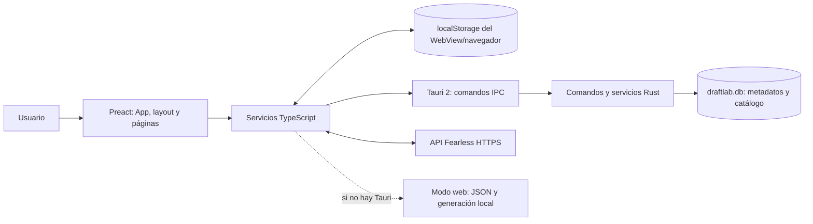

# Arquitectura de PersoBuilder

Este documento explica cómo funciona la implementación actual y dónde realizar cambios. Describe las capas de la app, sus dependencias, el recorrido de los datos y los límites entre persistencia local y servicios remotos. La guía de comportamiento visible está en la [Guía de usuario](guia-de-usuario.md).

## 1. Resumen

PersoBuilder está dividido en una interfaz web y un host nativo opcional:

- **Interfaz:** Preact y TypeScript, empaquetados con Vite. Presenta pantallas y gestiona la interacción del usuario.
- **Host de escritorio/móvil:** Tauri 2 presenta la interfaz en un WebView. Sus comandos Rust ofrecen acceso al catálogo SQLite, generación de equipos y peticiones Fearless.
- **Modo web:** sirve la misma interfaz sin Tauri. Lee el catálogo JSON distribuido con el frontend y genera equipos en TypeScript. Las llamadas a Fearless se realizan con `fetch` y dependen de CORS.
- **Servicio Fearless:** API HTTPS configurada por el usuario; mantiene datos compartidos de una serie. Su implementación de servidor no forma parte de este repositorio.

## 2. Estructura y responsabilidades

### Frontend: `src/frontend/src`

| Carpeta/archivo | Responsabilidad y punto de entrada |
| --- | --- |
| `main.tsx` | Monta la aplicación e importa estilos globales. |
| `app/App.tsx` | Conecta hooks, inicia comprobaciones de conectividad y sincroniza pendientes cuando vuelve Online. Decide qué página renderizar. |
| `app/routes.ts` | Define los identificadores de pantalla y las entradas de navegación. Historial es una página, pero se abre desde Inicio y no está en la barra inferior. |
| `app/pageLayoutConfig.ts` | Configura título, icono, descripción y botón de volver por página. |
| `app/useAppNavigation.ts` | Mantiene navegación y pantalla de bienvenida en memoria. |
| `app/useChampionCatalog.ts` | Carga el catálogo y habilita reintentar su lectura. |
| `app/useTeamGeneration.ts` | Mantiene las opciones y el resultado temporal del generador; registra cada resultado en el historial local. |
| `layouts/AppLayout.tsx` | Presenta cabecera de modo, encabezado de página, área de scroll y navegación inferior. |
| `pages/` | Composición y estado local de cada pantalla. El CSS específico suele estar junto a su página. |
| `components/` | Tablas de equipos/draft, controles, iconos, temporizador y tarjetas reutilizables. |
| `services/` | Frontera entre las páginas y los detalles de persistencia, Tauri y HTTP. |
| `types/` | Tipos TypeScript compartidos, por ejemplo `Champion`, `Role` y `GeneratedTeams`. |

Las páginas no deberían crear otro header, footer o contenedor principal desplazable. El layout común mantiene esas áreas y reinicia la posición de scroll al cambiar de pantalla.

### Servicios TypeScript

| Servicio | Qué resuelve |
| --- | --- |
| `services/draftlab.ts` | Carga/valida campeones; delega comandos a Tauri o usa el fallback web para generar equipos. También precarga retratos. |
| `services/localHistory.ts` | Normaliza, lee, migra desde el formato anterior, escribe, limita y elimina registros del historial en localStorage. |
| `services/appSettings.ts` | Lee, normaliza y guarda la URL Fearless. Exige HTTPS y descarta credenciales, query y fragmento. |
| `services/connectionStatus.ts` | Mantiene estado Local/Online, llama al health check y evita comprobaciones demasiado frecuentes. |
| `services/fearlessSync.ts` | Lee/escribe la serie remota, mantiene cachés de lectura y reintenta registros locales pendientes. |

### Backend: `src/backend/src`

| Módulo | Responsabilidad |
| --- | --- |
| `application/commands.rs` | Funciones expuestas a la interfaz vía Tauri y cliente HTTP nativo para health/API. Valida método, ruta y URL. |
| `domain/champion.rs` | Estructuras serializadas de campeón, miembro de equipo y equipos generados. |
| `infrastructure/persistence/champion_repository.rs` | Aplica migraciones, importa un dataset versionado y consulta campeones. |
| `services/team_generator.rs` | Valida parámetros y construye equipos con el catálogo recibido. |
| `support/error.rs` | Tipos de errores que traducen fallos internos a mensajes de comando. |
| `lib.rs` | Crea el directorio de datos, inicializa SQLite y registra estado y comandos Tauri. |
| `main.rs` | Punto de entrada del ejecutable Tauri. |

## 3. Arranque de la aplicación

En el host Tauri, `lib.rs` prepara el directorio de datos de la app y abre `draftlab.db`. El repositorio aplica las migraciones pendientes y lee la versión del dataset que viene en `resources/data/dataset-meta.json`:

1. Si la versión coincide con `app_metadata.dataset_version`, conserva el catálogo actual.
2. Si no coincide, deserializa `resources/data/champions.json`.
3. En una transacción, reemplaza las filas de `champions` y actualiza la versión guardada. Si algo falla, la transacción evita dejar un catálogo parcialmente importado.
4. Se construye un cliente HTTP compartido y se registra junto a la conexión SQLite en el estado Tauri.
5. `main.tsx` monta `App`. La app carga el catálogo a través del servicio correspondiente y monta `AppLayout` después de la pantalla inicial.

En modo web no se ejecuta este arranque Rust. `draftlab.ts` obtiene `/champions.json`; el resultado se valida antes de entregarlo a las páginas.

## 4. Flujo de catálogo y generación

### Lectura del catálogo

1. Las pantallas reciben campeones mediante `useChampionCatalog`.
2. `draftlab.getChampions()` guarda una única promesa de carga para no repetir lecturas concurrentes.
3. En Tauri, invoca `get_champions`; el repositorio lee filas ordenadas por nombre y reconstruye la lista de roles.
4. En web, solicita el JSON público.
5. La respuesta se valida (ID entero, nombre, array de roles y ruta de imagen). Ante error se descarta la promesa almacenada para permitir reintento.

### Generación de equipos

`useTeamGeneration` conserva el modo de generación, número de equipos y resultado hasta que la pantalla desmonta o se cambia la configuración. Al pulsar Generar, `draftlab.generateTeams()` selecciona la implementación:

- **Tauri:** invoca `generate_teams`; Rust vuelve a leer el catálogo SQLite y llama al servicio de generación.
- **Web:** filtra campeones excluidos y genera el resultado en TypeScript.

El generador admite 1 o 2 equipos y los modos `roles` y `random`. Cada equipo contiene cinco campeones. El modo aleatorio mezcla el pool y toma 5 o 10 campeones sin repetir. En modo por posiciones, el backend busca una asignación válida para los roles TOP, JUNGLE, MID, ADC y SUPPORT; la selección de un campeón se excluye de los demás huecos. Puede devolver error si faltan candidatos o no se puede completar una asignación. Al obtener un resultado válido, el hook guarda sus IDs como registro `teams` local.

El fallback web es funcional pero no comparte el algoritmo de búsqueda recursiva del backend: elige candidatos aleatorios válidos por cada posición. Si no hay candidato para una posición, muestra error.

## 5. Interfaz y navegación

`App.tsx` es el compositor, no un router completo. Mantiene una página activa y renderiza condicionalmente la pantalla correspondiente. `AppLayout` contiene la navegación persistente y los estados de conexión. La ruta `?preview=<page>` existe para previsualizar pantallas durante el desarrollo; no es una ruta de navegación pública.

El estado transitorio —por ejemplo, el draft que aún no se ha guardado, la celda activa, la búsqueda y los filtros— vive en memoria. Al recargar, el draft incompleto se pierde. El historial sí se persiste por separado.

## 6. Persistencia y datos

### SQLite

Tauri guarda `draftlab.db` dentro del directorio de datos de la aplicación determinado por Tauri. La migración inicial (`0001_initial.sql`) crea:

| Tabla | Columnas y función |
| --- | --- |
| `schema_migrations` | Versión y fecha de cada migración aplicada. |
| `app_metadata` | Clave/valor, incluida la versión del catálogo importado. |
| `champions` | ID entero, nombre único, roles serializados y ruta de retrato. |

Actualmente SQLite no almacena historial, ajustes, drafts en curso ni datos de cuenta. Al añadir una tabla de usuario, crea una migración nueva; no modifiques una migración que ya puede estar aplicada en instalaciones existentes.

### `localStorage`

`localHistory.ts` guarda una lista de registros JSON bajo `perso-builder-local-history`. Un registro contiene:

| Campo | Significado |
| --- | --- |
| `id`, `kind`, `createdAt` | Identidad local, tipo (`teams` o `fearless`) y fecha ISO. |
| `blueTeam`, `redTeam` | IDs de campeones; 5 para un draft por lado y 0 o 5 para equipos. |
| `winner` | Ganador local opcional (`blue` o `red`). |
| `seriesId`, `gameNumber` | Identidad y número de partida Fearless. |
| `connectionMode` | Si la partida se creó en modo Local u Online. |
| `remoteGameNumber`, `syncStatus`, `syncError`, `syncAttemptCount`, `syncUpdatedAt` | Estado e información necesaria para reintentar la sincronización. |

El lector descarta registros mal formados, limpia IDs inválidos y admite datos anteriores desde `perso-builder-local-fearless-games` cuando aún no existe la clave nueva. El límite normal es de 250 registros: registros `pending` y `failed` se conservan primero, y los registros ordinarios más antiguos son los primeros que se eliminan al recortar. Si los pendientes ocupan toda la capacidad, un nuevo guardado falla en lugar de borrar la cola.

`appSettings.ts` usa `perso-builder-api-url` para la URL base. `connectionStatus.ts` usa `perso-builder-connection-status` para estado, URL, instante de comprobación y marca Local manual. La app no sincroniza estos valores entre dispositivos.

**Consecuencia operativa:** `localStorage` pertenece al perfil del WebView/navegador; no es `draftlab.db`. Limpiar los datos de la aplicación/perfil puede borrar historial y preferencias aunque SQLite siga conteniendo el catálogo.

## 7. Modo Local, Online y conectividad

El estado de conexión es una decisión de aplicación, no solo un indicador de red:

1. En Local, Fearless no consulta la serie ni sincroniza partidas. La lista de campeones usados procede del historial local. Puede haber una petición de health check al iniciar la app, al guardar una URL o al solicitar Online; comprobar salud no envía partidas.
2. Al entrar en Online, el health check comprueba `/api/health`; en la app nativa la respuesta debe tener HTTP exitoso y el cuerpo debe indicar `status: "ok"` y `api: "online"`.
3. Al volver a foco/visibilidad, se puede actualizar el estado si la comprobación anterior tiene más de 10 minutos. Una selección manual de Local se respeta durante estas comprobaciones automáticas; pulsar Online o guardar una URL en Ajustes ejecuta una comprobación explícita y puede cambiar el estado.
4. En Online, Draft combina IDs usados en los registros locales con los IDs leídos de la API.
5. Al guardar un Fearless, la escritura local ocurre antes de la petición remota.
6. Cuando el estado pasa a Online, `App.tsx` inicia el reintento de las partidas pendientes.

El modo web tiene comprobación de health mediante `fetch`, por lo que el servidor necesita permitir CORS. El cliente nativo usa `reqwest`, tiene timeout de cinco segundos y desactiva las redirecciones. Los resultados de lectura remota de Fearless se cachean durante 30 segundos para evitar consultas repetidas.

## 8. Contrato de sincronización Fearless

La serie predeterminada del cliente es `fearless-001`. Los datos remotos se leen y escriben por HTTP; el repositorio no contiene el backend de esa API.

| Método | Ruta | Uso del cliente |
| --- | --- | --- |
| `GET` | `/api/health` | Probar si la API está disponible. |
| `POST` | `/api/series` | Asegurar que exista la serie; una respuesta de “ya existe” se acepta. |
| `GET` | `/api/series/{seriesId}/used-champions` | Obtener IDs de campeones usados. Si la serie falta, el cliente la crea y repite la lectura. |
| `GET` | `/api/series/{seriesId}` | Obtener juegos y su número, composición, fecha y ganador opcional. |
| `POST` | `/api/series/{seriesId}/games` | Enviar `gameNumber`, `blueTeam`, `redTeam` e `idempotencyKey`. |

La integración administrativa se describe en [el contrato con FearlessSync](fearlesssync-admin-api.md).

Antes de enviar, el cliente comprueba que haya cinco IDs enteros positivos por equipo y que no existan campeones repetidos en la partida. La API asigna/valida el número remoto; el cliente guarda localmente el número antes de enviar para reutilizarlo en un reintento. `idempotencyKey` usa el ID del registro local para que el servidor pueda reconocer una repetición.

La cola se procesa en orden dentro de cada serie. Si una partida falla, el cliente para esa serie en ese intento; no envía las siguientes con numeración posiblemente incorrecta. Otras series pueden continuar. Los estados de sincronización son `pending`, `synced` y `failed`.

### Validación de URL y rutas

La URL base debe ser HTTPS, sin nombre de usuario/contraseña, query o fragmento. El backend nativo rechaza además IPs privadas, loopback, link-local y no especificadas. `fearless_api_request` admite `GET`, `POST`, `PATCH`, `PUT` y `DELETE` bajo rutas que empiezan por `/api/`. Mantén las validaciones también en Rust: la comprobación TypeScript mejora el mensaje de usuario, pero no sustituye el límite del host nativo.

## 9. Comandos Tauri

| Comando | Entrada relevante | Respuesta/efecto |
| --- | --- | --- |
| `get_champions` | Ninguna. | Lee y serializa todos los campeones SQLite. |
| `generate_teams` | `mode`, `teamCount`, `excludedChampionIds`. | Valida y genera 1 o 2 equipos con el catálogo local. |
| `check_api_health` | `apiUrl`. | Contacta `/api/health` y devuelve estado HTTP, resultado y diagnóstico. |
| `fearless_api_request` | `apiUrl`, `method`, `path`, `body`. | Hace una llamada HTTP restringida y devuelve estado y cuerpo. |

Tauri convierte los argumentos `snake_case` del backend a los nombres camelCase usados por `invoke`. Para añadir un comando, define su validación/errores en Rust y regístralo en el `invoke_handler` de `lib.rs`; encapsula la llamada desde un servicio frontend en lugar de invocar desde múltiples páginas.

## 10. Errores y límites de confianza

- El frontend trata el catálogo, la salida JSON remota y los datos de `localStorage` como entradas que pueden ser inválidas y valida/normaliza cada una.
- El backend vuelve a validar los parámetros del generador y limita solicitudes Fearless por esquema, host, método y prefijo de ruta.
- Los errores del repositorio y dominio se convierten en mensajes para los comandos; los detalles se registran por stderr en el host nativo.
- Una falla HTTP no deshace el guardado local de un draft. Una falla al escribir el historial local sí impide confirmar el guardado.
- El ID de campeón se almacena en el historial, no una copia completa del objeto; al mostrar el historial, se resuelve contra el catálogo actual. Si un ID ya no está en el catálogo, no se muestra su tarjeta de campeón.
- El modo web tiene restricciones de origen del navegador y no dispone de los controles de red nativos de Tauri.

## 11. Añadir o modificar una función

1. Identifica si el cambio afecta interfaz, regla de negocio, persistencia o contrato externo.
2. Mantén el acceso a APIs y persistencia detrás de `services/`; no dupliques llamadas HTTP o `localStorage` dentro de varias páginas.
3. Si necesita datos nuevos, define su forma y validación antes de conectar la UI. Si afecta SQLite, añade una migración versionada.
4. Para comportamiento distinto en Web/Tauri, implementa ambos caminos o documenta el límite explícitamente.
5. Actualiza la [Guía de usuario](guia-de-usuario.md) para cambios visibles y este documento para cambios en límites, datos, comandos o flujos.
6. Actualiza la guía de recursos si cambia el dataset y el README si cambian comandos generales de desarrollo/build.

## 12. Documentos relacionados

- [README del proyecto](../README.md): requisitos, desarrollo, compilación y Android.
- [Guía de usuario](guia-de-usuario.md): pasos y resultados que ve quien usa la app.
- [Recursos del backend](../src/backend/resources/README.md): origen y actualización del catálogo.
- [Iconos de posiciones](../src/frontend/public/icons/roles/README.md): correspondencia y procedencia de los iconos.
